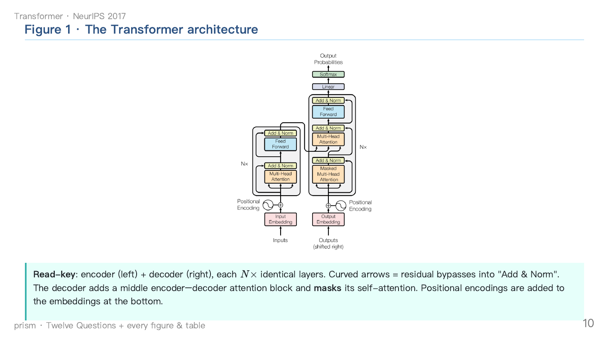
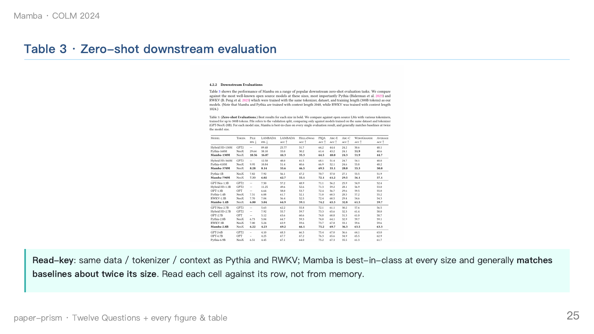

# paper-prism

> **一篇论文，折射成完整知识包。** 一个 Claude Code skill，把一篇学术论文——或者整个文献库——变成结构化的 Obsidian 知识包：一篇深度主笔记、一套幻灯片（PDF + 可编辑 PPTX）、以及一张互联的概念图谱。


[English](README.md) · **简体中文**

---

## 它能做什么

把 paper-prism 指向一个 PDF、一个 arXiv 链接，或一个 Zotero 分类。它产出三件互相绑定的产物：

- **一篇主笔记** —— 最厚、最深的产物。十二问深度解读、公式三件套（名称 / `$$LaTeX$$` / 含义 / 符号表）、每一张图和表都有讲解、每个技术术语首次出现都用 `[[概念]]` 内联链接。
- **一套幻灯片** —— 约 30 页的 Marp deck，输出 **PDF + 可编辑 PPTX**，每张图 / 每张表各占一页并配「读图要点」框。它是主笔记的视觉浓缩，不是它的目录。
- **一张概念图谱** —— 概念笔记、项目级阅读队列、全局幻灯片索引，全部自动创建并幂等更新，让你的 vault 始终可导航。

单篇论文约 8 分钟，整个 Zotero 分类一晚跑完——是同一条流水线；批量只是给它喂更长的队列。

**一图速览：**

```text
  INPUT · 7 modes
  PDF · arXiv · Zotero · folder · YAML queue · .bib/references · discovery feed
                          │
                          ▼   build & dedup queue
  ┌────────────────── PIPELINE · 5 phases  (parallel by default) ──────────────────┐
  │  1 setup  ▸  2 fan-out ⚡  ▸  3 synthesize  ▸  4 render + bind ⚡  ▸  5 report   │
  │                                                                                │
  │  Phase 2 — three subagents at once:                                            │
  │     A · Opus     twelve questions  +  note body                                │
  │     B · Sonnet   figures   (arXiv HTML → download → verify)                     │
  │     C · Sonnet   tables    (pdftoppm → PIL crop — screenshots, never re-typed)  │
  │                                                                                │
  │  checkpoint / resume (断点重连): a crashed re-run resumes from the missing phase │
  └───────────────────────────────────┬────────────────────────────────────────────┘
                          │   Plan C · three-piece binding
                          ▼
  OUTPUT · one self-contained unit per paper   (+ vault-wide indexes)
  {project}/{method}.md ───────────────── deep main note  (Obsidian entry)
  {project}/_slides/{method}/
       ├─ {method}.pdf ───────────────── original paper
       ├─ {method}.slides.pdf / .pptx ── deck:  PDF + editable PPTX
       └─ assets/ ────────────────────── figures + table screenshots
  _MOC/Slide Library.md  +  project reading-queue MOC ──── auto-indexed
  _concepts/ ──────────────────────────── linked concept graph
```

---

## 安装

```bash
git clone https://github.com/ArthurYangX/paper-prism.git
cd paper-prism
./install.sh          # 把 skill 软链到 ~/.claude/skills/ 并运行依赖检查
cp skills/paper-prism/assets/config.example.json skills/paper-prism/assets/config.json
# 然后编辑 config.json——至少设置 vault_path
```

`install.sh` 把 `skills/paper-prism/` 软链进 `~/.claude/skills/` 以便 Claude Code 发现它（斜杠命令即 `/paper-prism`），然后运行一个依赖 doctor 检查下列工具。

**依赖：**

| 工具 | 用途 | 安装 |
|---|---|---|
| **Python 3.10+** + **Pillow** | 裁表（PIL） | `pip install Pillow` |
| **Node** + **`@marp-team/marp-cli`** | 把 deck 渲成 PDF + PPTX | `npm i -g @marp-team/marp-cli` |
| **poppler**（`pdftoppm`） | 把 PDF 页渲成 PNG 以截表 | `brew install poppler` / `apt install poppler-utils` |
| *可选* **PyYAML** | 更好的 YAML 队列解析（内置了零依赖的迷你解析器） | `pip install pyyaml` |
| *可选* **Zotero** | Zotero 输入模式（只读） | 本地 Zotero |

Python 辅助脚本**优先用标准库**：paper-prism 的配置与绑定逻辑无需任何第三方包即可导入运行。Pillow、Node/Marp、poppler 只在你真的渲染 deck 时才被调用。

---

## 快速上手

装好后，下面这些是你**对 Claude Code 说的话**——不是 shell 命令。当你说的话匹配它的 description（下面这些短语）时，paper-prism 会**自动触发**；你也可以用 **`/paper-prism`** 显式调用。

**单篇 → 笔记（默认），或完整 deck 套件：**

```text
read paper.pdf and make a deck
```

> 默认决策树："read X" 给你完整笔记，不渲幻灯。"make a deck / 出 PPT" 给你完整三件套。有歧义？paper-prism 只问一次，然后记住。

**整个 Zotero 分类：**

```text
process my Zotero "Continual Learning" collection — full package for each
```

**一个可复现的 YAML 队列**（可纳入 git、可断点续跑、可逐篇覆盖参数——推荐的批量入口）。说：

```text
batch from papers.yaml
```

其中 `papers.yaml` 形如：

```yaml
project: Demo
parallel: 4
notes_strategy: full          # full | deck-only | analysis-only

papers:
  - id: transformer
    arxiv: "1706.03762"       # arXiv ID 必须加引号（裸数字会被当成浮点数）
    method_name: Transformer
    category: "attention · sequence modeling"
    priority: P1
  - id: mamba
    arxiv: "2312.00752"
    method_name: Mamba
    category: "SSM · long-sequence"
  - id: my-paper
    path: ~/papers/yourpaper.pdf   # 一个本地 PDF
    method_name: MyMethod
```

每篇论文只需 `path` / `arxiv` / `zotero` 三者其一。完整规范见 `skills/paper-prism/assets/queue-format.md`。

### 七种输入模式——同一条流水线，不同的队列来源

| 模式 | 你说什么 | 来源 |
|------|----------|------|
| 1 · 单篇 | `read X.pdf` · `make a deck for X` | 一个 PDF / arXiv id / Zotero 标题 |
| 2 · 文件夹 | `batch ~/papers/` | 文件夹里所有 `*.pdf` |
| 3 · Zotero 分类 | `process my Zotero "X" collection` | 一个 Zotero 分类（递归） |
| 4 · YAML 队列 | `batch from papers.yaml` | 可纳入 git 的队列文件（推荐） |
| 5 · Zotero 查询 | `process Zotero papers tagged X` | 一个 Zotero 标签/查询 |
| 6 · 参考文献 / `.bib` | `process this paper's references` · `batch from refs.bib` | 一篇论文的参考文献，或 LaTeX `.bib` |
| 7 · 发现源 | `today's papers → deck the top 5` · `batch from digest.json` | 一个推荐 feed（每日精选、主题检索…） |

模式 1–6 是「你指着自己已有的论文」；**模式 7 是「发现源把论文送到你面前」**。paper-prism **不抓取、不打分**——那留给独立的上游 skill（每日精选、文献检索、Semantic Scholar、arXiv）。它们只吐一个 `{title, arxiv?, score?, why?}` 的 JSON 列表（或 `.bib`）；paper-prism 把它收进队列、折射留下的那些。这样 paper-prism 始终是专注的深加工后端。

```bash
python3 skills/paper-prism/assets/prism_refs.py bib  refs.bib            # .bib       → 队列
python3 skills/paper-prism/assets/prism_refs.py pdf  paper.pdf           # PDF 参考文献 → 队列
python3 skills/paper-prism/assets/prism_refs.py discovery digest.json --top 5   # feed → 队列
```

---

## 实际效果

两篇公开论文，端到端折射成完整的 paper-prism 产物——主笔记 · 幻灯 deck · 图表截图 · 互联 MOC——都在 [`examples/showcase/`](examples/showcase/run-attention/)：

| 论文 | 笔记 | Deck | 产出方式 |
|------|------|------|----------|
| **Transformer** —— *Attention Is All You Need* | [Transformer.md](examples/showcase/run-attention/vault/papers/Showcase/Transformer.md) | 35 页 | coordinator 串行驱动 |
| **Mamba** —— *Selective State Spaces* | [Mamba.md](examples/showcase/run-attention/vault/papers/Showcase/Mamba.md) | 39 页 | 真实的 A/B/C 并行 subagent 扇出，再由 coordinator 复核归并 |

<p align="center">
  
  
</p>

两篇共享同一个 `Showcase` 阅读队列 MOC 和全局幻灯片库——跨论文的索引累积，已实证。渲染出的 PDF/PPTX 已 gitignore 以保持仓库轻量；用一条 `marp` 命令即可逐篇重生成（见 showcase 的 [README](examples/showcase/run-attention/README.md)）。

---

> **这就是完整闭环——装上、说出你想要的、拿到绑定好的笔记 + deck。** 下面是*为什么*和*怎么做*：流水线内部、完整配置、设计理念。想深入就翻；开始用不需要它们。

---

## 工作原理

deck 流水线（`make a deck`）跑五个阶段——**默认并行**：

```text
阶段 1 · Setup            解析配置、方法名、arxiv_id、路径；建 deck 目录              （串行，<10s）
阶段 2 · 三路扇出 ⚡        Agent A（Opus）：十二问 + 笔记正文
                          Agent B（Sonnet）：arXiv HTML → 下载 → 校验图
                          Agent C（Sonnet）：pdftoppm → PIL 裁表
阶段 3 · Synthesize        用这 3 份产物填充幻灯模板 + 笔记模板                        （串行）
阶段 4 · 渲染 + 绑定 ⚡     marp → PDF + PPTX · 拷入原 PDF · 资源块 ·
                          幻灯片库行 · 项目 MOC 行                                    （并行）
阶段 5 · 报告              校验 5 件产物 + MOC 行 · 清理 /tmp · 打印路径
```

主 agent 充当 coordinator：先把活扇给三个 subagent（阶段 2），再复核它们的产出、组装笔记 + deck（阶段 3）——`main → subagents → main`。批量（文件夹 / Zotero / YAML）在外面套一个 `/loop` 主控 prompt：扫描 → 按已有产物去重 → 每轮派出 `parallel` 个 paper-coordinator → 队列空则停止。失败写入错误日志，**绝不阻塞**下一篇。完整设计见 `docs/architecture.md`。

---

## 配置

复制 `config.example.json` → `config.json`（已 gitignore——它保存你的私有 vault 路径）并编辑。配置按以下顺序解析，命中即止：

1. `$PRISM_CONFIG` —— 指向某个 JSON 文件的显式路径
2. `skills/paper-prism/assets/config.json` —— 模块旁边
3. `~/.config/paper-prism/config.json` —— XDG 风格的用户配置
4. 内置默认值 —— 因此即使没有任何配置 paper-prism 也能导入

关键字段：

| 键 | 含义 | 默认 |
|---|---|---|
| `vault_path` | 你的 Obsidian vault 根目录（`~` 会展开） | `~/Documents/Obsidian Vault` |
| `notes_folder` / `default_project` | `{vault}/{notes_folder}/{project}/` | `papers` / `Research` |
| `concepts_folder` · `moc_folder` · `slides_subdir` | 概念、索引、deck 各自所在 | `_concepts` · `_MOC` · `_slides` |
| `zotero_db` / `zotero_storage` | 仅 Zotero 输入模式用（只读） | `~/Zotero/...` |
| `models` | 扇出时各 subagent 的模型档位 | `analysis: opus`，`figures/tables: sonnet` |
| `parallel` / `concept_budget` | 每轮 loop 的论文数 / 每篇最多新建概念数 | `4` / `8` |
| `git_commit` / `git_push` | 选择性开启 vault 的 git 自动化 | `false` / `false` |
| `lang` | **`en` 或 `zh`** —— 生成标题的语言 | `en` |
| `labels` | 覆盖任意单个标题文案 | `{}` |

**i18n（国际化）。** paper-prism 生成的标题是可配置的。设 `"lang": "en"`（默认）或 `"lang": "zh"` 即可翻转每个输出标题——"Resources" ↔ "资源"、"TL;DR" ↔ "一句话总结"、MOC 列名、收件箱文件夹等等——并可在 `"labels"` 下覆盖任意单条。skill 逻辑和你的 prompt 用什么语言都行；只有*写出来的标题*跟随 `lang`。

```bash
python3 skills/paper-prism/assets/prism_config.py   # 打印解析后的配置 + 当前生效的标签
```

---

## Zotero 联动（可选）

如果某篇论文在你的 Zotero 库里，paper-prism 会在笔记的资源块加一行一键跳转链接：

```text
- 📦 Zotero: [Open in Zotero (annotations)](zotero://select/library/items/{key})
```

点它 → Zotero 跳到该条目 → 打开 PDF 即见你的**标注**（标注存在 Zotero 数据库里，不在 PDF 文件里）。

**零插件，除了两次一次性点击外零配置：**

1. 点链接时 **Zotero 要开着**（点链接是唤起它）。
2. **第一次**点 `zotero://` 链接时，Obsidian 会问是否允许打开外部链接——**允许一次**即可，以后不再问。

就这些。paper-prism 用**归一化标题**把笔记标题匹配到 Zotero 条目（**只读**——绝不改你的库），用稳定的 8 位 itemKey，所以链接不随 citekey 格式或附件重整理而失效。

> **你*不*需要** Zotero Integration 插件、Better BibTeX、或 PDF Utility。那些是把标注*文本*同步进笔记（另一个功能），且依赖脆弱的 citekey——paper-prism 刻意不碰它们。如果你确实想把标注文本拉进 Obsidian，那是另一套插件配置，不在 paper-prism 范围内。

---

## 产出布局

**Plan C —— 三件套绑定。** 模式 A（vault，默认）：每篇论文是一个自洽单元，外加一个全局索引。

```text
{vault}/{notes_folder}/{project}/
├── {method}.md                 主笔记（Obsidian 入口）
└── {slides_subdir}/{method}/
    ├── {method}.pdf            原始论文（拷贝进来）
    ├── {method}.slides.md      Marp 源
    ├── {method}.slides.pdf     deck（嵌入 / 浏览）
    ├── {method}.slides.pptx    可编辑 deck
    └── assets/                 {method}_fig_*.png, {method}_table_*.png
{vault}/{moc_folder}/Slide Library.md   ← 全局幻灯片索引
```

模式 B（`local` / `next to the PDF` / `don't put it in Obsidian`）：所有东西落在 `{pdf_dir}/_slides/{method}/`，不拷 PDF、不绑定笔记、不更新 MOC。

在 Obsidian 里，deck PDF 和原始 PDF 会在笔记顶部内联嵌入（`![[...]]`）；`.slides.md` 配 Marp / Advanced-Slides 插件可预览；`.pptx` 用 Keynote/PowerPoint 打开。

---

## 为什么是 paper-prism？

单篇体验固然不错，但 paper-prism 存在的真正理由在于**规模化**——把 100 篇论文变成一个知识库，而不是 100 个互不相干的转储。

| 规模化时真正咬人的痛点 | paper-prism 的做法 |
|---|---|
| 全程用 Opus 读，单篇又慢又贵 | **并行 subagent 扇出**——分析（Opus）+ 抽图（Sonnet）+ 抽表（Sonnet）三个 agent 并发；约 8 分钟/篇，比全 Opus 省约 3 倍（50 篇 ≈ Opus×50 + Sonnet×100）。 |
| 100 篇朴素跑 → 约 2000 个半成品 `[[wikilink]]`、图谱崩坏 | **概念预算**（默认 ≤8 个新概念/篇）+ **别名去重**，让 `Mamba` / `Mamba SSM` / `Selective SSM` 不会变成三个文件；超出预算的降级为粗体。 |
| 批量跑到第 60 篇崩了，前功尽弃 | **断点重连（Checkpoint & resume）**——项目级状态文件 + 每篇的持久化缓存，重跑时既跳过已完成的论文，*又*能从半成品论文缺失的那一阶段继续（在「渲染」阶段崩溃绝不会重跑 Opus 分析）。绑定操作原地替换；失败被隔离，绝不阻塞下一篇。 |
| 笔记、幻灯、原始 PDF 各自漂移 | **三件套绑定（Plan C）**——主笔记 + 幻灯 + 原始 PDF 作为一个自洽单元同住一处，由资源块串联，并同时索引进项目 MOC 和全局幻灯片库。 |
| AI 重打结果表会改坏数字 | **表格铁律——一律截原图**——每一张主结果表和消融表都嵌入*原文截图*，绝不用 markdown 重画。重打会破坏数字、加粗、箭头和合并单元格。 |
| `de2021continual.pdf` 这种文件名得到垃圾方法名 | **方法名按置信度提取**（Zotero 标题 → "we propose X" → 反复出现的缩写 → 询问），让批量正确命名，而不是把论文叫成 `Continual`。 |

以上全部已在 `skills/paper-prism/SKILL.md` 和 Python 辅助脚本中实现——不是画饼。

---

## 十二问框架

paper-prism 从不直接跳到产出。在任何笔记或幻灯之前，它先回答关于这篇论文的**十二个问题**——而且每个答案都带一条**「我怎么判断自己真的看懂了」的自检标准**。这条自检才是重点：它把「摘要」变成「你能脱稿复述的东西」，而不是对 abstract 的流畅改写。

| # | 问题 | # | 问题 |
|---|---|---|---|
| Q1 | 解决什么问题？ | Q7 | 如何验证？（数据 · baseline · 指标 · 消融） |
| Q2 | 现有方法的缺口？ | Q8 | 提升来自哪里？ |
| Q3 | 核心 insight ⭐（直觉，不是模块清单） | Q9 | 局限（≥2；未明说的标【inferred】） |
| Q4 | Pipeline（输入 → 模块 → 输出） | Q10 | 能否迁移？ |
| Q5 | 各模块作用（去掉会怎样） | Q11 | 如何改进？ |
| Q6 | 公式到底在*做什么*？ | Q12 | 用 2–3 句讲清 |

批量模式下，paper-prism 对每篇先跑一个浓缩五问（Q1 + Q3 + Q4 简版 + Q9 + Q12），需要时再展开——但**绝不跳过**这个框架。完整模板、自检措辞、以及「段落意图」追问模式见 `skills/paper-prism/references/twelve-questions.md`。

---

## 项目状态

**v0.1.0** —— 可用，并已在真实论文上跑过。笔记/幻灯/图谱产物和绑定都已稳定；skill 的*内部* prompt、阶段接线和配置键随着持续打磨仍可能调整。测试套件 **138 项检查、零外部依赖**（`python3 tests/test_prism.py`）。见 [CHANGELOG.md](CHANGELOG.md)。

经过对抗式验证打磨：针对验证中发现的头号失败模式（多行结果表里**编造 / 张冠李戴的数字**），加固了数字单元格溯源、禁止编造 baseline、baseline 行核对、跨表「最佳」按 delta-from-baseline 排序、以及保留原文措辞力度等规则。

---

## 致谢

paper-prism 是对 **`paper-reader`** skill 的大幅重构。该 skill 的作者是 **[huangkiki](https://github.com/huangkiki)**，出自 [**dailypaper-skills**](https://github.com/huangkiki/dailypaper-skills) 项目，依 **Apache-2.0** 许可使用。（在开发机上它是被打包在 [ARIS](https://github.com/wanshuiyin/Auto-claude-code-research-in-sleep) skill 合集里发现的。）完整署名与 Apache-2.0 的「修改声明」见 [NOTICE](NOTICE)。

| `paper-reader` 提供了 | paper-prism 新增了 |
|---|---|
| Zotero 集成范式 | 带逐问自检的十二问框架 |
| Obsidian 概念库框架 | Plan-C 三件套绑定（笔记 + deck + 原始 PDF） |
| 论文笔记模板 | Marp deck 生成（PDF + 可编辑 PPTX） |
| 多源图片回退 | 表格截原图铁律 |
| | 并行 subagent 扇出（分析 / 抽图 / 抽表） |
| | 批量正确性所需的方法名提取 |
| | 项目 + 全局 MOC 自动更新 |
| | 概念预算 + 别名去重 |
| | 配置驱动的 i18n（`en`/`zh`，可覆盖标签） |
| | 断点重连 + 参考文献/.bib 导入 |
| | 零依赖测试套件 |

完整署名见 [NOTICE](NOTICE)。

---

## 许可证

MIT —— 见 [LICENSE](LICENSE)。Copyright © 2026 yangjc27。
