<!-- _class: title -->

# Mamba: Linear-Time Sequence Modeling with Selective State Spaces

### Albert Gu · Tri Dao
### COLM 2024 (arXiv Dec 2023)

<span class="tag">selective SSM</span> <span class="tag">linear-time</span> <span class="tag">sequence modeling</span>

`arxiv.org/abs/2312.00752` · `github.com/state-spaces/mamba`

---

## TL;DR · one card

> Make a structured SSM's parameters **input-dependent** (a selection mechanism), so a linear-time recurrent model can decide *by content* what to remember or forget — then keep it fast with a hardware-aware parallel scan.

| | |
|---|---|
| **Problem** | A linear-time backbone that matches attention quality on dense/discrete data (text) |
| **Core idea** | Selectivity: $\Delta, B, C$ become functions of the input → content-based reasoning |
| **Cost** | Input-dependence kills the convolution fast-path → needs a custom parallel-scan kernel |
| **Effect** | Matches Transformer++ ≤1.4B, SOTA DNA/audio, ~5× inference throughput, scales to 1M tokens |
| **Follow-up** | ★★★ (foundational alternative backbone) |

---

<!-- _class: section-divider -->

# 1. Problem & Gap

### Q1 · Q2

---

## Q1 · What problem does it solve

**Scenario**: general-purpose autoregressive sequence modeling — the backbone of foundation models across language, audio, genomics.

**Pain points**:
- Transformers are **effective** (attention compresses nothing) but cost **quadratic** training + a growing **KV cache** at inference.
- Subquadratic alternatives (linear attention, gated convs, RNNs, SSMs) are **efficient** but had not matched attention on **dense/discrete** data like text.

**Goal**: keep the **linear-time, constant-state** efficiency of a recurrent SSM while reaching **Transformer quality**.

---

## Q2 · Where prior methods fall short (Gap)

| Category | Representative | Flaw | How Mamba attacks it |
|----------|----------------|------|----------------------|
| Attention | Transformer | quadratic + O(L) KV cache; "compresses nothing" | linear-time recurrence, constant state |
| Efficient attention | sparse / linear attn | lose what made attention effective; "not shown effective at scale" | keep a true recurrent state |
| Structured SSMs | S4, H3, Hyena, RWKV | **LTI** — constant dynamics → no content-based reasoning | make dynamics **input-dependent** |

> **Key diagnosis**: prior fast SSMs are **Linear Time-Invariant** by necessity (that's what makes them convolutions) — and LTI is *exactly* what blocks content selection.

---

<!-- _class: section-divider -->

# 2. Core Insight ⭐

### Q3

---

<!-- _class: insight -->

## Q3 · Core idea

> **Sequence modeling is compressing context into a finite state, and good compression must be content-aware: the model must decide, per token, what to write / keep / discard. A model with a fixed update rule has a knob for *where* a token is, but none for *what* it is.**

**Why it was hard before**:
- Making the recurrence input-dependent destroys time-invariance — the very property every fast SSM used to run as a convolution.

**How this paper solves it**:
- Let $\Delta, B, C$ be functions of the input (selectivity), and pay for the lost convolution with a hardware-aware parallel scan.

**Cost**: no more convolution fast-path → a custom GPU kernel becomes mandatory.

---

<!-- _class: insight -->

## Q3 · Why this insight works

| Capability | Intuition | How it is realized |
|------------|-----------|--------------------|
| Filter irrelevant tokens | reset state on noise/fillers | input-dependent $\Delta$ (forget gate) |
| Hold relevant context indefinitely | stop overwriting useful memory | small $\Delta$ → $\bar A\to 1$ |
| Content-based recall | what enters/leaves state depends on token | selective $B$ (write), $C$ (read) |
| Stay linear-time | no quadratic attention | recurrence + parallel scan |

**Theoretical anchor**: Theorem 1 — the selective recurrence *contains* the classical gated RNN as a special case.

---

<!-- _class: section-divider -->

# 3. Architecture

### Q4 · Q5 · the mechanism & block

---

## Figure 1 · Selective SSM with hardware-aware state expansion


<div class="figkey">

**Read-key**: each channel $x$ maps to $y$ through a higher-dim latent $h$; the **selection mechanism** produces input-dependent $(\Delta_t, B_t, C_t)$. Orange = fast GPU **SRAM** where discretize + scan happen; the large $D{\cdot}N$ state is never written to slow **HBM**.

</div>

---

## Figure 2 · The motivating synthetics

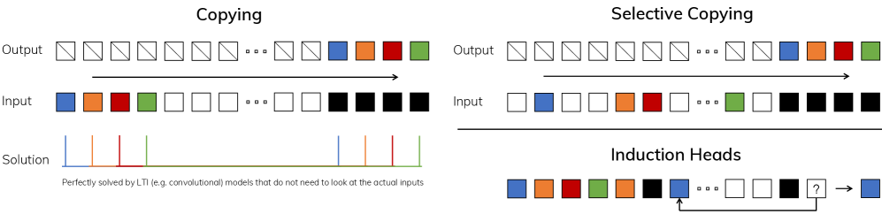

<div class="figkey">

**Read-key**: standard **Copying** has constant spacing → solvable by a time-invariant (convolutional) model. **Selective Copying** randomizes spacing → needs a *time-varying* model that filters by content. **Induction Heads** needs associative recall ("Harry → Potter").

</div>

---

## Figure 3 · The Mamba block (H3 ⊗ Gated MLP → Mamba)

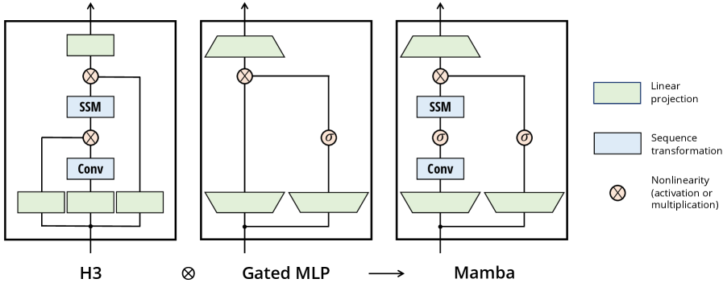

<div class="figkey">

**Read-key**: Mamba fuses the H3 SSM block with the ubiquitous MLP block into **one homogeneous unit**. vs H3: first multiplicative gate → an activation; vs MLP: an SSM added to the main branch (σ = SiLU/Swish). Stacked uniformly — no attention, no separate MLP.

</div>

---

## Q4 · Pipeline (text version)

```
Input tokens  x  (B, L, D)
   ↓  input projection, expand D by E=2
Mamba block  (×N, homogeneous)
   ↓  [ short causal Conv → SiLU ]
   ↓  [ Selective SSM (S6):  Δ,B,C = Linear(x);  h_t = Ā_t h_{t-1} + B̄_t x_t ;  y = C_t h_t ]
   ↓  ⊗  parallel gated branch (SiLU)
   ↓  output projection,  + residual / norm
   ↓  (repeat)
Linear → logits
```

---

## Q5 · Role of each module

| Module | What it does | What breaks without it |
|--------|--------------|------------------------|
| Selective SSM (S6) | content-based memory (the accuracy) | revert to LTI S4 → Selective Copying 18.3% vs 97.0% (Table 1) |
| Hardware-aware scan | makes selectivity practical (the speed) | no convolution exists → O(BLDN) HBM blow-up |
| Δ selectivity | per-token forget/focus gate | biggest single degradation (Table 7) |
| Selective B, C | what enters / leaves the state | bigger state $N$ stops helping (Table 10) |
| Mamba block | simplicity / uniformity | ≈ performance-neutral vs H3 (Table 6) |

---

<!-- _class: section-divider -->

# 4. Math

### Q6 · formula triplets

---

## Q6 · Formula 1/4 · SSM: continuous → discrete recurrence

$$
h'(t) = A\,h(t) + B\,x(t),\quad y(t)=C\,h(t)
$$

$$
h_t = \bar A\,h_{t-1} + \bar B\,x_t,\quad y_t = C\,h_t
$$

**Meaning**: a linear system compresses the past into state $h$; the discrete form is the per-step inference recurrence — **constant time/step, no cache**.

**Intuition**: $h$ is a running summary; $A$ controls how it decays, $B$/$C$ write-in / read-out.

---

## Q6 · Formula 2–3/4 · the LTI shortcut & discretization

$$
\overline K = (C\bar B,\ C\bar A\bar B,\ \ldots),\quad y = x * \overline K
$$

$$
\bar A = \exp(\Delta A),\qquad \bar B \approx \Delta B
$$

**Meaning**: when $(\bar A,\bar B,C)$ are constant, the recurrence **equals a convolution** with kernel $\overline K$ — the fast parallel training mode prior SSMs relied on, and exactly what selectivity gives up. ZOH turns $(\Delta,A,B)$ into discrete operators; $\Delta$ is the focus/forget dial.

---

## Q6 · Formula 4/4 · the selection mechanism

$$
B = \text{Linear}_N(x),\quad C = \text{Linear}_N(x)
$$

$$
\Delta = \text{softplus}\big(\text{Param} + \text{Broadcast}_D(\text{Linear}_1(x))\big)
$$

**Meaning**: the *one change* defining Mamba — $\Delta, B, C$ become functions of the current token, making the SSM **time-varying**.

**Theorem 1**: with $N{=}1, A{=}{-}1, B{=}1$, this reduces **exactly** to a gated RNN $h_t=(1-g_t)h_{t-1}+g_t x_t$ — grounding heuristic gates as input-dependent discretization.

---

<!-- _class: section-divider -->

# 5. Experiments

### Q7

---

## Q7 · Datasets, baselines, setup

| Modality | Dataset | Use |
|----------|---------|-----|
| Synthetic | Selective Copying / Induction Heads (L→$2^{20}$) | content-memory & extrapolation |
| Language | The Pile (125M–1.3B), zero-shot suite | LM scaling + downstream |
| Genomics | HG38 human genome | DNA pretraining + finetune |
| Audio | YouTubeMix piano, SC09 | pretraining + generation |

**Baselines**: Transformer / Transformer++ · Hyena/HyenaDNA · RWKV · RetNet · Pythia · SaShiMi / WaveNet / DiffWave.
**Setup**: $E{=}2$, $N{=}16$, real SSM (complex for audio); custom fused **A100** scan kernel; code + checkpoints open-sourced.

---

<!-- _class: section-divider -->

# 6. Results

### One page per figure / table · each with a read-key

---

## Figure 4 · Induction Heads — length extrapolation

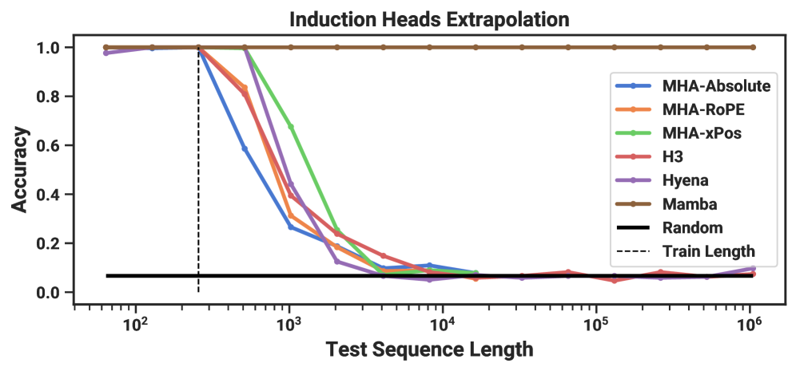

<div class="figkey">

**Read-key**: trained at length **256**, only Mamba generalizes (perfect) to $2^{20}\approx$ **1M** tokens — ~4000× longer than training — while every other method, including all attention position-encoding variants, fails to extrapolate much past training length.

</div>

---

## Table 1 · Selective Copying accuracy

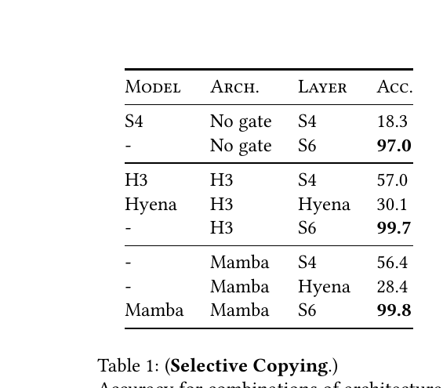

<div class="figkey">

**Read-key**: the **selective inner layer** (S4→S6) is what solves the task. Gated *architectures* alone (H3, Mamba block) only partially help; adding **selection** pushes accuracy to ~99%. Architecture gating ≠ a selection mechanism.

</div>

---

## Figure 5 · Language-modeling scaling laws (The Pile)

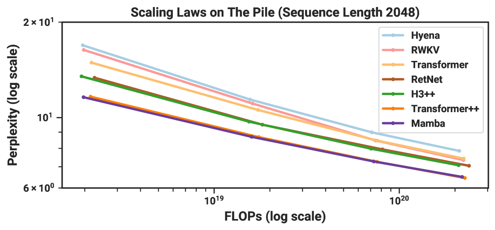

<div class="figkey">

**Read-key**: over ≈125M–1.3B params, Mamba is the **first attention-free model to match the strong "Transformer++" recipe**, and its advantage grows at longer sequence length. (RWKV/RetNet 8k points missing for lack of efficient implementations.)

</div>

---

## Table 3 · Zero-shot downstream evaluation

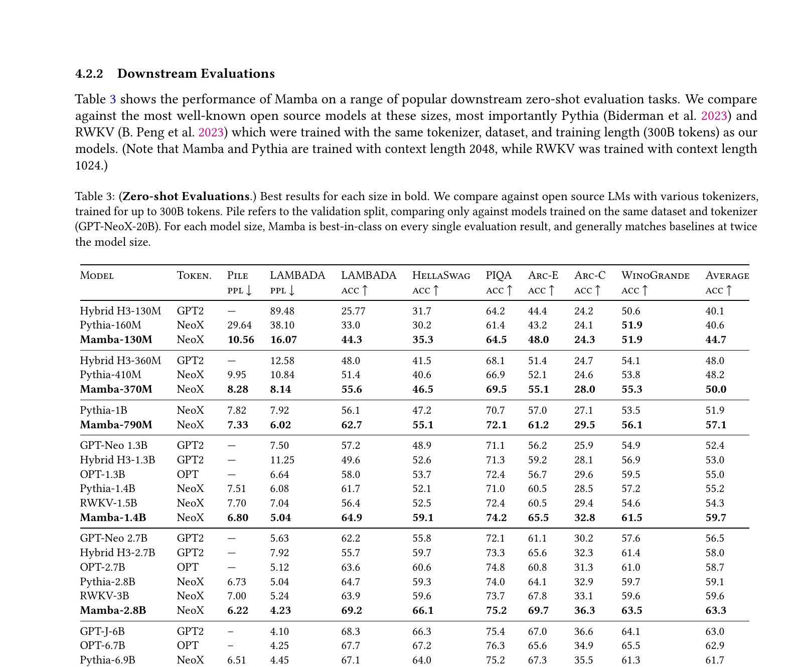

<div class="figkey">

**Read-key**: same data / tokenizer / context as Pythia and RWKV; Mamba is best-in-class at every size and generally **matches baselines about twice its size**. Read each cell against its row, not from memory.

</div>

---

## Figure 6 · DNA scaling (HG38) — size & context length

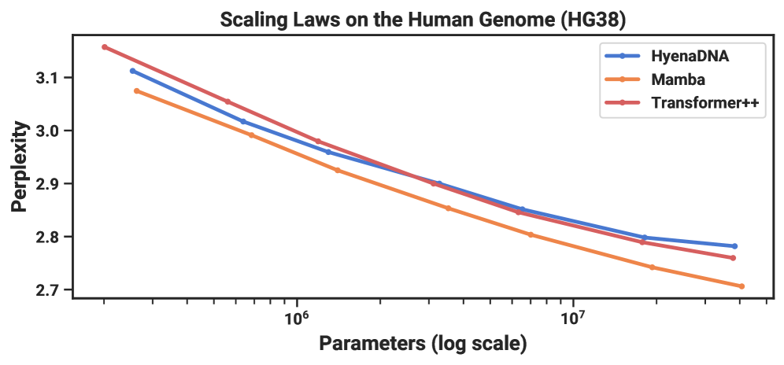

<div class="figkey">

**Read-key**: Left — at fixed context, Mamba scales better than HyenaDNA and Transformer++ (matches them with ~3–4× fewer params). Right — as context → $2^{20}\approx$1M, Mamba **keeps improving** while HyenaDNA **worsens**: selective forgetting at work (computation held fixed).

</div>

---

## Figure 7 · Audio pretraining (YouTubeMix)

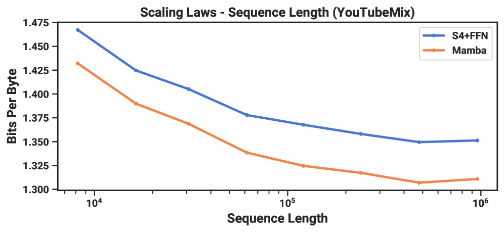

<div class="figkey">

**Read-key**: both Mamba and the SaShiMi (S4+MLP) baseline improve with longer context (bits-per-byte), but Mamba is better throughout and the gap **widens** at minute-long / million-length sequences (computation held fixed).

</div>

---

## Table 4 · SC09 unconditional speech generation

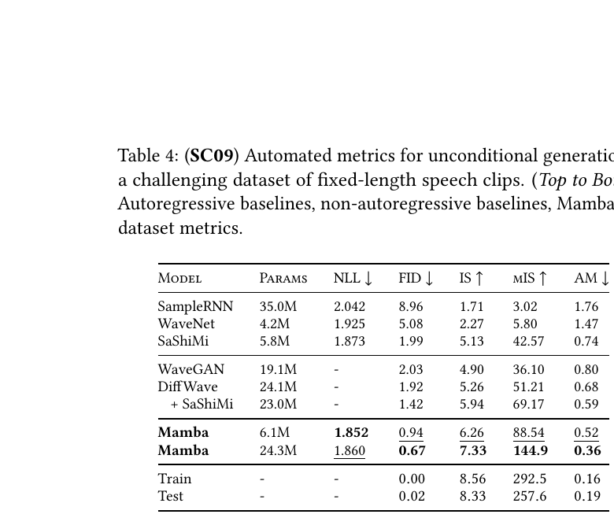

<div class="figkey">

**Read-key**: a small **6.1M** Mamba beats much larger GAN/diffusion baselines (WaveGAN 19.1M, DiffWave+SaShiMi 23–24M) on fidelity (FID / IS / mIS / AM); a 24.3M Mamba improves further. SaShiMi (5.8M, S4+MLP) is the SSM baseline.

</div>

---

## Table 5 · SC09 architecture ablation

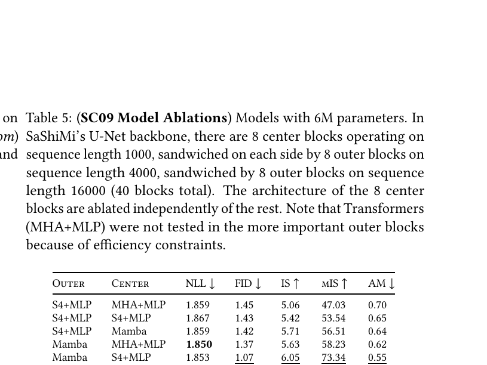

<div class="figkey">

**Read-key**: Mamba > S4+MLP in the **outer** blocks consistently, and in the **center** blocks Mamba > S4+MLP > MHA+MLP. The gains come from the **Mamba layer**, not the U-Net backbone.

</div>

---

## Figure 8 · Efficiency — scan speed & inference throughput

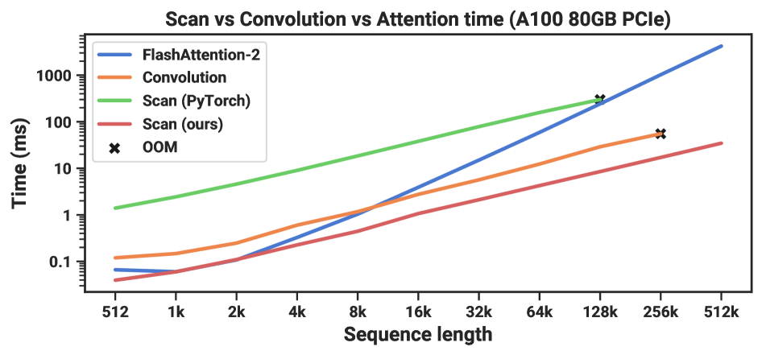
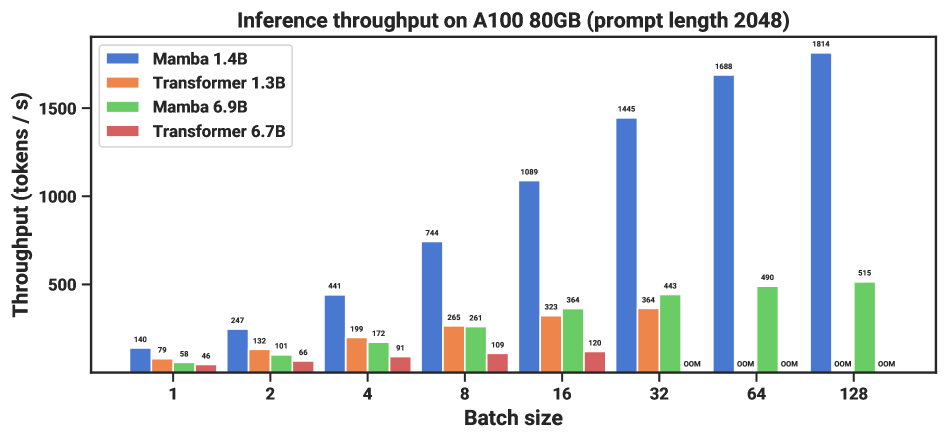

<div class="figkey">

**Read-key**: top — the fused selective scan is ~20–40× faster than a standard PyTorch scan and beats FlashAttention-2 beyond ~2K length. bottom — as a cache-free recurrent model, Mamba sustains ~4–5× higher inference throughput than a similar-size Transformer.

</div>

---

<!-- _class: section-divider -->

# 7. Source of Gains

### Q8

---

## Q8 · Where the gains come from

| Source | Contribution | Evidence |
|--------|--------------|----------|
| Selective inner layer (S6) ⭐ | primary — the accuracy | Table 1 (18.3→97.0), Table 6 (S4→S6 dominates) |
| Δ selectivity | most important single parameter | Table 7 |
| Selective B, C + state size N | content-aware state expansion | Table 10 (N helps only if B,C selective) |
| Hardware-aware scan | the efficiency (not accuracy) | 20–40× scan, ~5× throughput (Fig 8) |
| Mamba block redesign | simplicity, ≈ neutral | Table 6 (≈ H3 block) |

> Accuracy = **selectivity in the inner layer**; speed = **the fused scan**; the block redesign buys **uniformity**, not points.

---

<!-- _class: section-divider -->

# 8. Limits · Transfer · Improve

### Q9 · Q10 · Q11

---

## Q9 · Limitations (honest list)

1. **Scale unproven** (author) — largest model ~2.8B; 7B–70B left open, "may involve further engineering."
2. **No free lunch on continuous data** (author) — selectivity can *hurt* on audio waveforms (needs complex state).
3. **Transformer affordances untested** (author) — finetuning, ICL, prompting, RLHF, quantization not evaluated.
4. **Efficiency is GPU-specific** 【inferred】 — 20–40× / 5× rest on an A100-tuned kernel; the 6.9B throughput uses an *untrained* model.
5. **Extrapolation evidence is synthetic** 【inferred】 — 1M-token generalization shown on copy/induction, not a real long-range task.

---

## Q10 · Can it transfer

| Direction | How |
|-----------|-----|
| Across modalities | shown: language + DNA + audio with one backbone |
| Long context | quality *improves* to 1M tokens (DNA/audio) |
| Hybridize | interleave a few attention layers (paper's own ablation) |

> Not a one-task model — a **general linear-time backbone**. (Historically: a major Transformer alternative line.)

---

## Q11 · Improvement ideas

**💡 Hybrid Mamba + attention**
- Interleave a few attention layers for exact arbitrary-position recall.
- Benefit: best of both; risk: reintroduces quadratic cost, loses block uniformity.

**💡 Modality-adaptive real/complex state**
- Let each layer learn real vs complex, closing the continuous-data gap.
- Benefit: no manual switch; risk: doubled state cost.

**💡 Scale + affordance study**
- Train ≥7B and evaluate ICL / instruction-tuning / RLHF / quantization.
- Benefit: answers the two biggest open questions; risk: compute-heavy.

---

<!-- _class: takeaway -->

## Q12 · Take-away

> A tiny, well-diagnosed change — make the SSM's parameters **input-dependent** — plus systems co-design (a hardware-aware parallel scan) gives a linear-time recurrent model **Transformer-quality** on dense data, SOTA on DNA/audio, ~5× inference throughput, and clean scaling to million-length sequences.

<br>

| Dimension | Rating |
|-----------|--------|
| **Insight real or not** | real — a structural diagnosis + minimal fix |
| **Engineering value** | ★★★ |
| **Worth following up** | ★★★ (foundational alternative backbone) |
| **Recommendation** | read closely · reproduce · cite |

---

## Related Work

**Prior**
- **S4 / S4D / H3 / S5** — the structured-SSM lineage Mamba builds on (and removes time-invariance from).
- **HIPPO** — the continuous-memory theory behind SSM initialization.

**Compared with**
- **Transformer++ / RWKV / RetNet / Hyena** — the quality + efficiency bars.

**Follow-up (historical)**
- **Mamba-2, hybrid SSM-attention LLMs** — the line this launched.

---

<!-- _class: title -->

# Thank you

### `paper-prism` · Twelve Questions + every figure & table
### Produced by a parallel A/B/C subagent fan-out, reconciled by the coordinator

### Want the full Obsidian note? Open `Mamba.md`
