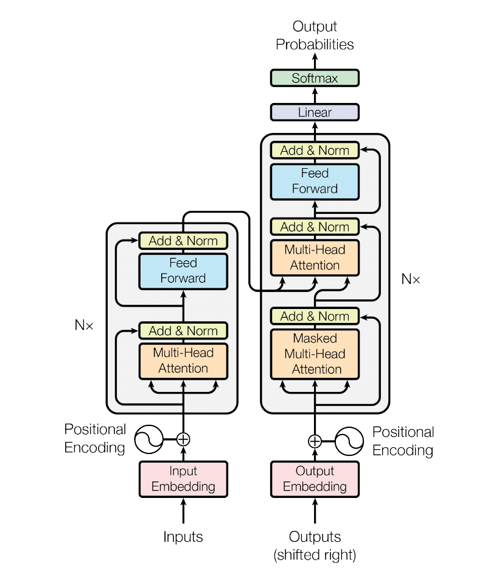
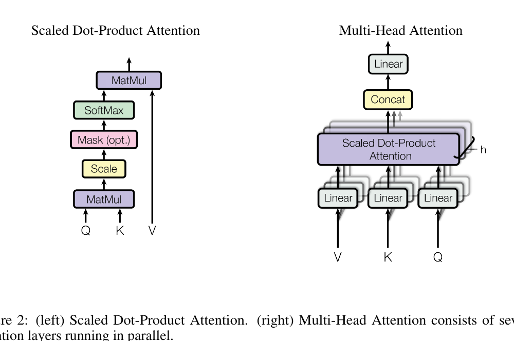
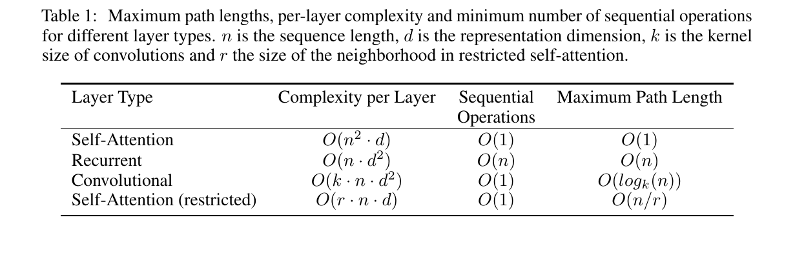
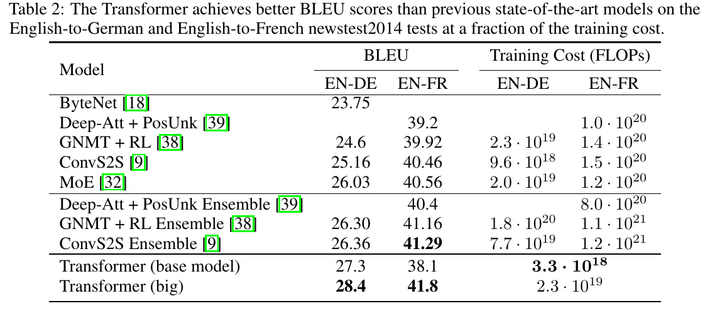
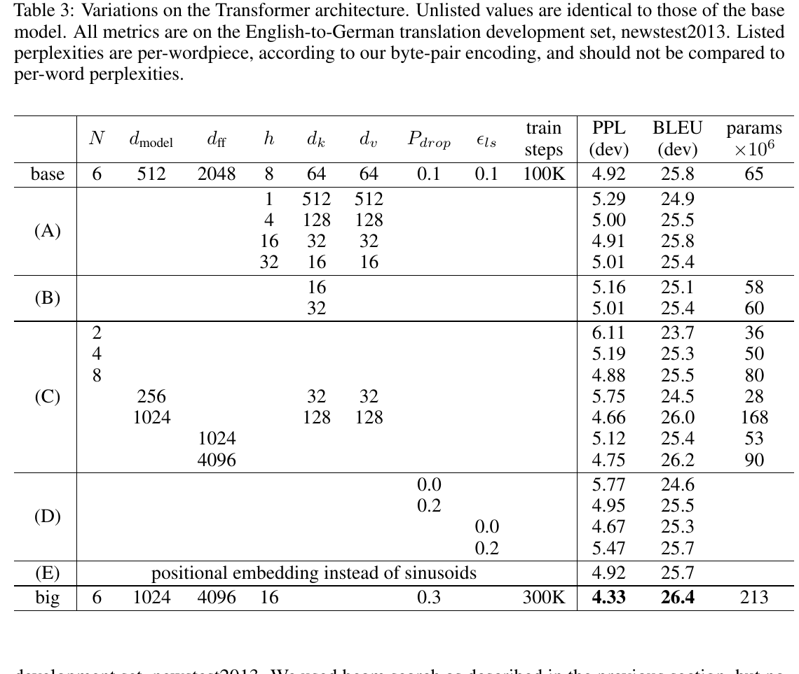
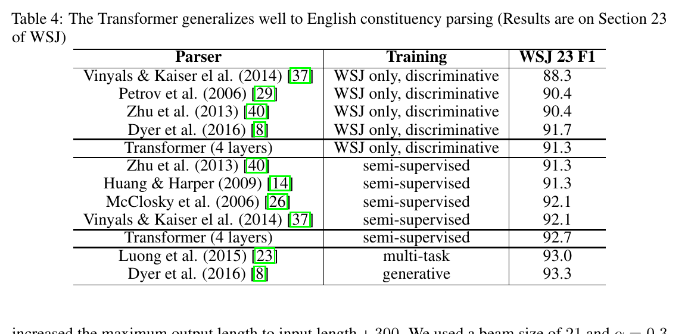
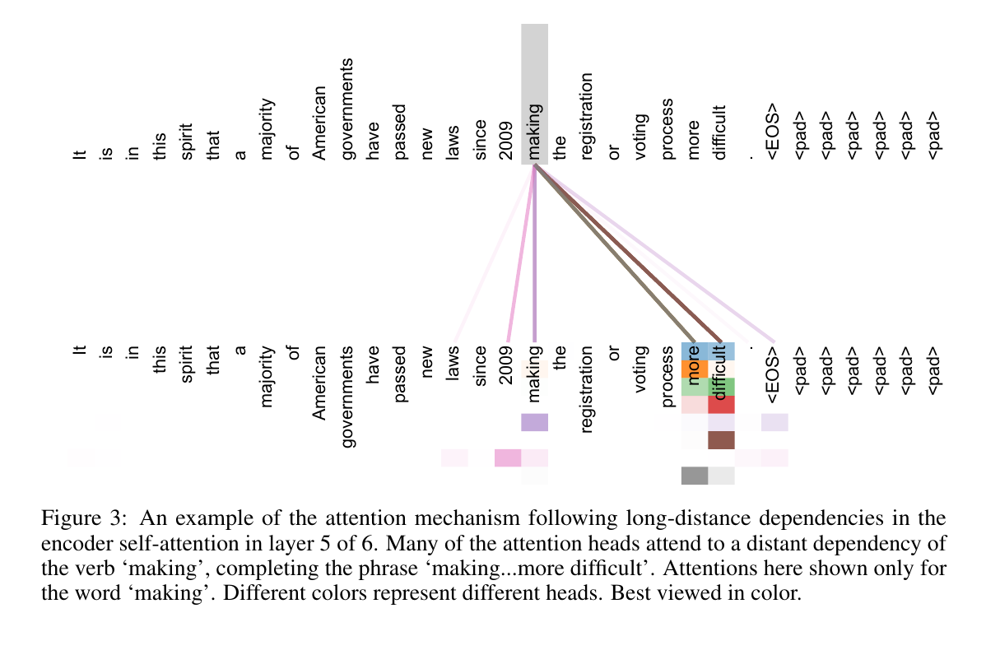

<!-- _class: title -->

# Attention Is All You Need

### Vaswani, Shazeer, Parmar, Uszkoreit, Jones, Gomez, Kaiser, Polosukhin
### NeurIPS (NIPS) 2017

<span class="tag">transformer</span> <span class="tag">self-attention</span> <span class="tag">machine-translation</span>

`arxiv.org/abs/1706.03762` · `github.com/tensorflow/tensor2tensor`

---

## TL;DR · one card

> A sequence model built **entirely from attention** — no recurrence, no convolution. Every position attends to every other, so the path between any two tokens is $O(1)$ and the layer is fully parallel.

| | |
|---|---|
| **Problem** | Sequence transduction (MT) without sequential recurrence |
| **Core idea** | Replace recurrence with multi-head self-attention → $O(1)$ paths, full parallelism |
| **Cost** | $O(n^2)$ attention in sequence length; needs positional encodings + many heads |
| **Effect** | WMT'14 28.4 EN-DE / 41.8 EN-FR BLEU — SOTA at a fraction of the training compute |
| **Follow-up** | ★★★ (foundational) |

---

<!-- _class: section-divider -->

# 1. Problem & Gap

### Q1 · Q2

---

## Q1 · What problem does it solve

**Scenario**: sequence transduction — most prominently machine translation — done with recurrent encoder–decoder networks + attention.

**Pain points**:
- Recurrence is **inherently sequential**: $h_t$ depends on $h_{t-1}$, so no parallelism within a training example.
- Long sequences hit memory limits; relating two distant tokens takes $O(n)$ steps.

**Goal**: a transduction architecture that keeps attention's modeling power but **removes recurrence**, enabling parallel training and short dependency paths.

**Why now**: attention was already the workhorse of strong MT systems — the paper asks whether it can stand **alone**.

---

## Q2 · Where prior methods fall short (Gap)

| Category | Representative | Flaw | How this paper attacks it |
|----------|----------------|------|---------------------------|
| Recurrent | seq2seq, GNMT | sequential compute; $O(n)$ path between positions | drop recurrence entirely |
| Convolutional | ConvS2S, ByteNet | ops to relate two positions grow with distance (linear / log) | self-attention: $O(1)$ path, constant ops |
| Self-attention (partial) | reading-comp / summarization | used only as an *add-on* to RNNs | first model relying on self-attention **alone** |

> **Key diagnosis**: the bottleneck is the *distance-dependent path length* between tokens — collapse it to a constant and the rest follows.

---

<!-- _class: section-divider -->

# 2. Core Insight ⭐

### Q3

---

<!-- _class: insight -->

## Q3 · Core idea

> **If every position can attend directly to every other position, the path length between any two tokens becomes $O(1)$ and the whole layer is fully parallel — order and resolution, the two things you lose, are cheap to add back.**

**Why it was not possible before**:
- Recurrence and convolution both relate distant positions only through *many* intermediate steps, so gradients for long-range dependencies are weak.

**How this paper solves it**:
- One self-attention layer = a global, content-addressed mixing step; distance no longer costs depth.

**Cost**: attention is $O(n^2)$ in sequence length; a single average has limited resolution → fixed with **multi-head**; order is lost → restored with **positional encodings**.

---

<!-- _class: insight -->

## Q3 · Why this insight works

| Capability | Intuition | How it is realized |
|------------|-----------|--------------------|
| Long-range dependency | any two tokens are one hop apart | global self-attention ($O(1)$ path) |
| Parallel training | no token waits for its predecessor | matrix ops over the whole sequence |
| Multiple relations at once | track syntax *and* position simultaneously | $h=8$ attention heads in separate subspaces |
| Order awareness | attention is permutation-invariant alone | additive sinusoidal positional encodings |

**Theoretical anchor**: Table 1 makes the argument quantitative — self-attention's *sequential operations* and *maximum path length* are both constants.

---

<!-- _class: section-divider -->

# 3. Architecture & Algorithm

### Q4 · Q5 · every architecture figure

---

## Figure 1 · The Transformer architecture



<div class="figkey">

**Read-key**: encoder (left) + decoder (right), each $N\times$ identical layers. Curved arrows = residual bypasses into "Add & Norm". The decoder adds a middle encoder–decoder attention block and **masks** its self-attention. Positional encodings are added to the embeddings at the bottom.

</div>

---

## Figure 2 · Scaled Dot-Product & Multi-Head Attention



<div class="figkey">

**Read-key**: left — one attention's operator chain (MatMul → Scale → Mask(opt.) → SoftMax → MatMul). Right — multi-head: project $Q,K,V$ into $h$ subspaces, attend in parallel, concat, project. The "$h$" marks the stack of parallel heads.

</div>

---

## Table 1 · Why self-attention (complexity)



<div class="figkey">

**Read-key**: the quantitative case for the design. Self-attention costs more per layer ($O(n^2 d)$) but drives **sequential operations** and **maximum path length** to constants, while a recurrent layer's path length grows with sequence length. Short paths → easier long-range learning.

</div>

---

## Q4 · Pipeline (text version)

```
Input tokens
   ↓  embedding × √d_model  +  positional encoding
Encoder  (N = 6 layers)
   ↓  [ multi-head self-attention → Add&Norm ]
   ↓  [ position-wise FFN        → Add&Norm ]
Decoder  (N = 6 layers)
   ↓  [ masked self-attention      → Add&Norm ]
   ↓  [ encoder–decoder attention  → Add&Norm ]
   ↓  [ position-wise FFN          → Add&Norm ]
   ↓  Linear → Softmax
Output probabilities (next token)
```

---

## Q5 · Role of each module

| Module | What it does | What breaks without it |
|--------|--------------|------------------------|
| Scaled dot-product attn | similarity-weighted value lookup, scaled by $1/\sqrt{d_k}$ | large-$d_k$ softmax saturates → vanishing gradients |
| Multi-head attn | $h$ parallel attentions in different subspaces | single head: −0.9 BLEU; loses parallel relations |
| Position-wise FFN | per-position non-linear transform | little non-linear capacity left |
| Positional encoding | inject token order | encoder becomes order-blind |
| Masked self-attn | enforce auto-regression | future-token leakage |
| Residual + LayerNorm | stabilize the deep stack | poor gradient flow in 6+6 layers |

---

<!-- _class: section-divider -->

# 4. Math

### Q6 · formula triplets

---

## Q6 · Formula 1/4 · Scaled dot-product attention

$$
\text{Attention}(Q,K,V) = \text{softmax}\!\left(\frac{QK^{\top}}{\sqrt{d_k}}\right) V
$$

**Meaning**: each query retrieves a convex combination of value vectors, weighted by query–key similarity.

**Symbols**: $Q,K \in \mathbb{R}^{\cdot \times d_k}$, $V \in \mathbb{R}^{\cdot \times d_v}$; $\sqrt{d_k}$ is the stabilizing temperature.

**Intuition**: a soft dictionary lookup — match query to every key, average the values, divide by $\sqrt{d_k}$ so the softmax doesn't saturate.

---

## Q6 · Formula 2/4 · Multi-head attention

$$
\text{MultiHead}(Q,K,V) = \text{Concat}(\text{head}_1,\dots,\text{head}_h)\,W^{O}
$$

$$
\text{head}_i = \text{Attention}(Q W_i^{Q}, K W_i^{K}, V W_i^{V})
$$

**Meaning**: run $h{=}8$ attentions in parallel subspaces ($d_k{=}d_v{=}64$) and merge.

**Intuition**: eight "views" of the sequence, each free to specialize (previous-token head, syntactic head, …), recombined into one representation.

---

## Q6 · Formula 3–4/4 · FFN & positional encoding

$$
\text{FFN}(x) = \max(0,\, x W_1 + b_1)\,W_2 + b_2 \qquad (d_{ff}=2048)
$$

$$
PE_{(pos,2i)} = \sin\!\left(\tfrac{pos}{10000^{2i/d_{\text{model}}}}\right),\quad
PE_{(pos,2i+1)} = \cos\!\left(\tfrac{pos}{10000^{2i/d_{\text{model}}}}\right)
$$

**Meaning**: a per-position ReLU MLP between attention steps; sinusoids of geometric wavelengths encode absolute position.

**Intuition**: $PE_{pos+k}$ is a *linear* function of $PE_{pos}$ → the model can attend by **relative** offset. (Ablation: learned positions perform identically.)

---

<!-- _class: section-divider -->

# 5. Experimental Setup

### Q7

---

## Q7 · Datasets & baselines

| Task | Dataset | Scale | Tokenization |
|------|---------|-------|--------------|
| MT | WMT'14 EN-DE | ~4.5M pairs | 37K shared BPE |
| MT | WMT'14 EN-FR | ~36M sentences | 32K word-piece |
| Transfer | WSJ constituency parsing | 40K / +17M | — |

**Baselines**: ByteNet · Deep-Att+PosUnk · GNMT+RL · ConvS2S · MoE (and their ensembles).

---

## Q7 · Metrics + training details

**Metrics**: BLEU (translation quality) · training cost in FLOPs · F1 (parsing).

**Training / implementation**
- **Models**: base (512/2048/h8, 65M params) · big (1024/4096/h16, 213M params)
- **Optimizer**: Adam ($\beta_1{=}0.9$, $\beta_2{=}0.98$) + warmup-then-inverse-sqrt schedule ($warmup{=}4000$)
- **Regularization**: residual dropout 0.1 · label smoothing 0.1
- **Compute**: 8× P100 — base ~12 h (100K steps), big ~3.5 days (300K steps)

---

<!-- _class: section-divider -->

# 6. Results

### One page per figure / table · each with a read-key

---

## Table 2 · Main translation results



<div class="figkey">

**Read-key**: the big Transformer (bottom row) tops both EN-DE and EN-FR while sitting in the lowest training-cost bracket — "better quality **and** far less compute". The bottom two rows are this paper's models; every other row is a real baseline / baseline ensemble.

</div>

---

## Table 3 · Ablations on the Transformer



<div class="figkey">

**Read-key**: rows (A)–(E) each vary one factor from `base`. Heads have a sweet spot (too few **or** too many hurt); smaller $d_k$ hurts; bigger models help; dropout & label smoothing both help; **learned positions (E) ≈ sinusoids**.

</div>

---

## Table 4 · Generalization: constituency parsing



<div class="figkey">

**Read-key**: a Transformer trained for parsing with little task-specific tuning is competitive with strong, parsing-specific models in both WSJ-only and semi-supervised settings — the architecture transfers beyond translation.

</div>

---

## Figure 3 · Attention follows long-distance dependencies



<div class="figkey">

**Experimental setup**: an encoder self-attention head in layer 5; lines connect the query "making" to the keys it attends to (color = head, opacity = weight).

</div>

**What this figure argues**: a long-range dependency ("making … more difficult") is captured in a **single** attention hop — the $O(1)$ path of Table 1, made visible.

---

<!-- _class: section-divider -->

# 7. Ablation & Source of Gains

### Q8

---

## Q8 · Where the gains come from

| Source | Contribution | Evidence |
|--------|--------------|----------|
| Global self-attention ⭐ | primary — quality **and** the parallelism that cuts compute | Table 2 (SOTA + low FLOPs) |
| Multi-head | secondary — multiple relations at once | Table 3 (A): single head −0.9 BLEU |
| Model scale | secondary — bigger helps | Table 3 (C): big > base |
| Dropout + label smoothing | regularization safeguard | Table 3 (D) |

> Main gain = **removing recurrence in favor of global attention** (both quality and speed); secondary = multi-head + scale; regularization keeps the big model from over-fitting.

---

<!-- _class: section-divider -->

# 8. Limits · Transfer · Improve

### Q9 · Q10 · Q11

---

## Q9 · Limitations (honest list)

1. **Quadratic in sequence length** — self-attention is $O(n^2 d)$ (Table 1); restricted attention is proposed but **not evaluated at scale**.
2. **Narrow evaluation** — only translation + one parsing task; other modalities are future work.
3. **Length extrapolation** — sinusoids are *hypothesized* to extrapolate; **not verified** 【inferred】.
4. **Inference still sequential** — decoding remains auto-regressive; the $O(1)$ path helps training, not generation latency 【inferred】.
5. **Best model still costly** — 213M params, 3.5 days on 8 P100.

---

## Q10 · Can it transfer

| Direction | How to do it |
|-----------|--------------|
| Other NLP structured prediction | shown: constituency parsing (Table 4) |
| Long sequences | restricted / local attention (paper flags this) |
| Other modalities (image/audio/video) | named as future work |

> Not a replacement for one task — a **general** sequence backbone. (Historically: BERT, GPT, ViT.)

---

## Q11 · Improvement ideas

**💡 Restricted / local attention**
- Limit each position to a neighborhood of size $r$.
- Benefit: breaks the $O(n^2)$ wall; risk: may lose some long-range reach.

**💡 Less-sequential generation**
- Non-autoregressive or partially parallel decoding.
- Benefit: lower inference latency; risk: quality drop without careful design.

**💡 Relative-position encodings**
- Replace absolute sinusoids with relative offsets.
- Benefit: better length generalization; risk: added complexity (row E shows learned ≈ sinusoid, so headroom exists).

---

<!-- _class: takeaway -->

## Q12 · Take-away

> The first sequence-transduction model built **entirely** from attention: it replaces recurrence with multi-head self-attention, making training fully parallel and the path between any two tokens $O(1)$ — and it sets a new WMT'14 state of the art at a fraction of the training cost.

<br>

| Dimension | Rating |
|-----------|--------|
| **Insight real or not** | real — a structural, not incremental, change |
| **Engineering value** | ★★★ |
| **Worth following up** | ★★★ (foundational) |
| **Recommendation** | read closely · reproduce · cite |

---

## Related Work

**Prior**
- **attention (Bahdanau)** — content-based alignment, generalized here to self-attention.
- **ConvS2S / ByteNet** — cutting sequential computation with convolutions.

**Follow-up (historical)**
- **BERT / GPT** — the encoder-only / decoder-only descendants.
- **Vision Transformer (ViT)** — the architecture crossing into vision.

---

<!-- _class: title -->

# Thank you

### `prism` · Twelve Questions + every figure & table
### 35 pages

### Want the full Obsidian note? Open `Transformer.md`
### Want a deep dive on a section? Say "analyze Section X"
